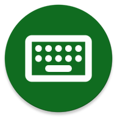
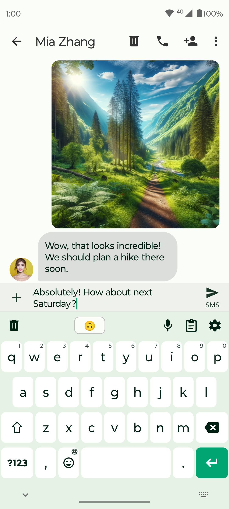
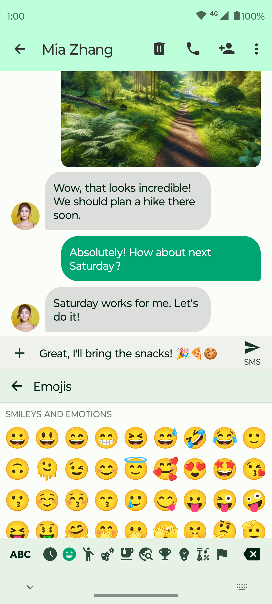
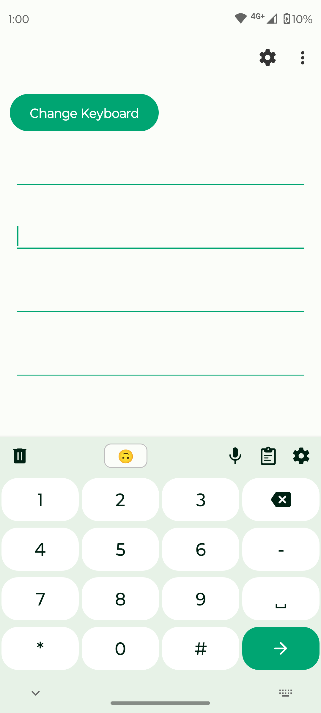

# বাংলাটাইপ কীবোর্ড (BanglaType Keyboard)



<p>
  
  
  
  
</p>

**বাংলাটাইপ** একটি সম্পূর্ণ **অফলাইন, ওপেন-সোর্স ও প্রাইভেসি-বান্ধব** বাংলা কীবোর্ড অ্যাপ। বন্ধুদের সাথে চ্যাট হোক কিংবা লেখালেখি, সংখ্যা বা সিম্বল টাইপ করা—সব কাজেই দ্রুত, সহজ ও আরামদায়ক টাইপিং অভিজ্ঞতা দিতে এটি তৈরি।

➡️ ওয়েবসাইট: https://amadersomaj.com
➡️ ফেসবুক: https://www.facebook.com/BanglaTypeKeyboard

<div align="center">



</div>

---

## 📑 সূচিপত্র

- [প্রধান বৈশিষ্ট্য](#-প্রধান-বৈশিষ্ট্য)
- [সমর্থিত লেআউট](#-সমর্থিত-লেআউট)
- [প্রাইভেসি](#-প্রাইভেসি)
- [ইনস্টলেশন](#-ইনস্টলেশন)
- [সোর্স থেকে বিল্ড](#-সোর্স-থেকে-বিল্ড)
- [প্রজেক্ট কাঠামো](#-প্রজেক্ট-কাঠামো)
- [অবদান রাখুন](#-অবদান-রাখুন)
- [লাইসেন্স](#-লাইসেন্স)
- [কৃতজ্ঞতা](#-কৃতজ্ঞতা)

---

## ✨ প্রধান বৈশিষ্ট্য

### ⌨️ টাইপিং
- **একাধিক বাংলা লেআউট** — অভ্র (ফোনেটিক), জাতীয় ও প্রভাত, সাথে ইংরেজি QWERTY
- **ওয়ার্ড সাজেশন / প্রেডিকশন** — টাইপ করার সময় শব্দের পরামর্শ
- **টেক্সট শর্টকাট** — ছোট ট্রিগার লিখে বড় লেখা বসানো
- **বাংলা সংখ্যা** — বাংলা লেখার সময় স্বয়ংক্রিয়ভাবে বাংলা ডিজিট
- **অটো ক্যাপিটালাইজেশন ও অটো পাংচুয়েশন**
- **স্পেসবার ভাষা পরিবর্তন** — স্পেসবারে সোয়াইপ করে দ্রুত ভাষা বদল

### 🖐️ এক হাতে টাইপিং (One-handed mode)
- কীবোর্ডকে **বাঁ বা ডান পাশে** সরিয়ে এক হাতে আরামে টাইপিং
- পাশে থাকা কন্ট্রোল দিয়ে **সাইড পরিবর্তন** বা **পূর্ণ প্রস্থে ফিরে যাওয়া**

### 🎯 জেসচার
- **স্পেসবার কার্সর কন্ট্রোল** (ঐচ্ছিক) — স্পেসবারে সোয়াইপ করে কার্সর সরানো
- **সোয়াইপ ডিলিট** — ব্যাকস্পেসে সোয়াইপ করে পুরো শব্দ মোছা

### 🎨 চেহারা ও থিম
- **কাস্টম কীবোর্ড থিম** (Gboard-স্টাইল) — নিজের ছবি বা গ্রেডিয়েন্ট ব্যাকগ্রাউন্ড
- **কাস্টমাইজেবল রঙ** — টেক্সট, কী ও অ্যাকসেন্ট রঙ নিজের মতো
- **ডার্ক থিম** ও ম্যাটেরিয়াল ডিজাইন
- কীবোর্ডের **উচ্চতা**, **কী বর্ডার** ও **কাস্টম ফন্ট** সেট করার সুবিধা

### 🛠️ আরও সুবিধা
- **ইন-অ্যাপ ভয়েস টাইপিং** — কথা বলে লেখা
- **ক্লিপবোর্ড ম্যানেজার** — ক্লিপ তৈরি ও প্রায়ই ব্যবহৃতগুলো পিন করা
- **ইমোজি** প্যালেট ও সার্চ
- ঐচ্ছিক **নাম্বার রো**
- কীপ্রেসে **ভাইব্রেশন, সাউন্ড ও পপআপ** (সম্পূর্ণ নিয়ন্ত্রণযোগ্য)

---

## 🌐 সমর্থিত লেআউট

| লেআউট | ধরন |
|--------|------|
| অভ্র (Avro) | বাংলা ফোনেটিক |
| জাতীয় (Jatiyo) | বাংলা ফিক্সড |
| প্রভাত (Probhat) | বাংলা ফিক্সড |
| English (QWERTY) | ইংরেজি |

---

## 🔒 প্রাইভেসি

- **সম্পূর্ণ অফলাইন** — ইন্টারনেট পারমিশন নেই, তাই কোনো ডেটা বাইরে যায় না
- কোনো ব্যবহারকারীর তথ্য সংগ্রহ বা শেয়ার করা হয় না
- ওপেন-সোর্স হওয়ায় কোড নিজে যাচাই করার সুযোগ আছে

---

## 📥 ইনস্টলেশন

> অ্যাপটি বর্তমানে ডেভেলপমেন্ট পর্যায়ে রয়েছে। রিলিজ APK পেলে এখানে লিংক যুক্ত করা হবে।

আপাতত নিচের নির্দেশনা অনুযায়ী সোর্স থেকে বিল্ড করে ইনস্টল করা যাবে।

---

## 🏗️ সোর্স থেকে বিল্ড

**প্রয়োজনীয়তা**

- Android Studio (সর্বশেষ সংস্করণ) অথবা কমান্ড-লাইন Gradle
- JDK 17
- Android SDK — সর্বনিম্ন API 26 (Android 8.0), টার্গেট API 36

**ধাপ**

```bash
# রিপো ক্লোন করুন
git clone https://github.com/<your-username>/BanglaType-Keyboard.git
cd BanglaType-Keyboard

# ডিবাগ APK বিল্ড করুন (core ভ্যারিয়েন্ট)
./gradlew assembleCoreDebug

# অথবা সরাসরি ডিভাইসে ইনস্টল করুন
./gradlew installCoreDebug
```

**প্রোডাক্ট ফ্লেভার**

অ্যাপে তিনটি ফ্লেভার আছে — প্রতিটির জন্য `assemble<Flavor>Debug` ব্যবহার করুন:

| ফ্লেভার | উদ্দেশ্য |
|---------|----------|
| `core` | সাধারণ বিল্ড |
| `foss` | F-Droid / FOSS বিতরণ |
| `gplay` | Google Play বিতরণ |

---

## 📂 প্রজেক্ট কাঠামো

```
app/        — মূল অ্যাপ্লিকেশন মডিউল (IME সার্ভিস, কীবোর্ড ভিউ, সেটিংস)
commons/    — ভেন্ডর করা শেয়ার্ড commons লাইব্রেরি (লোকাল মডিউল)
```

গুরুত্বপূর্ণ কিছু অংশ:

- `services/SimpleKeyboardIME.kt` — মূল ইনপুট মেথড সার্ভিস
- `views/MyKeyboardView.kt` — কীবোর্ড আঁকা, টাচ ও জেসচার হ্যান্ডলিং
- `helpers/Config.kt` — সব ইউজার সেটিংস (SharedPreferences)
- `activities/SettingsActivity.kt` — সেটিংস স্ক্রিন

**টেক স্ট্যাক:** Kotlin · Android IME framework · Room · ViewBinding · GPL v3

---

## 🤝 অবদান রাখুন

বাগ রিপোর্ট, ফিচার প্রস্তাব বা পুল রিকোয়েস্ট—সব ধরনের অবদানকে স্বাগত।

1. রিপো **fork** করুন
2. নতুন **branch** তৈরি করুন (`git checkout -b feature/my-feature`)
3. পরিবর্তন **commit** করুন
4. **Pull Request** পাঠান

নতুন বাংলা স্ট্রিং যোগ করলে `app/src/main/res/values-bn/strings.xml` ও `values-bn-rBD/strings.xml`-এ অনুবাদ যুক্ত করতে ভুলবেন না।

---

## 📄 লাইসেন্স

এই প্রজেক্ট **GNU General Public License v3.0 (GPL-3.0)** অধীনে প্রকাশিত।
বিস্তারিত [LICENSE](LICENSE) ফাইলে দেখুন।

---

## 🙏 কৃতজ্ঞতা

বাংলাটাইপ কীবোর্ড [Fossify Keyboard](https://github.com/FossifyOrg/Keyboard)-এর ভিত্তিতে তৈরি (de-Fossify করে commons লোকাল মডিউল হিসেবে অন্তর্ভুক্ত করা হয়েছে)। মূল ডেভেলপার ও অবদানকারীদের প্রতি কৃতজ্ঞতা।

---

<div align="center">
<sub>❤️ দিয়ে তৈরি — আমাদের সমাজ</sub>
</div>
