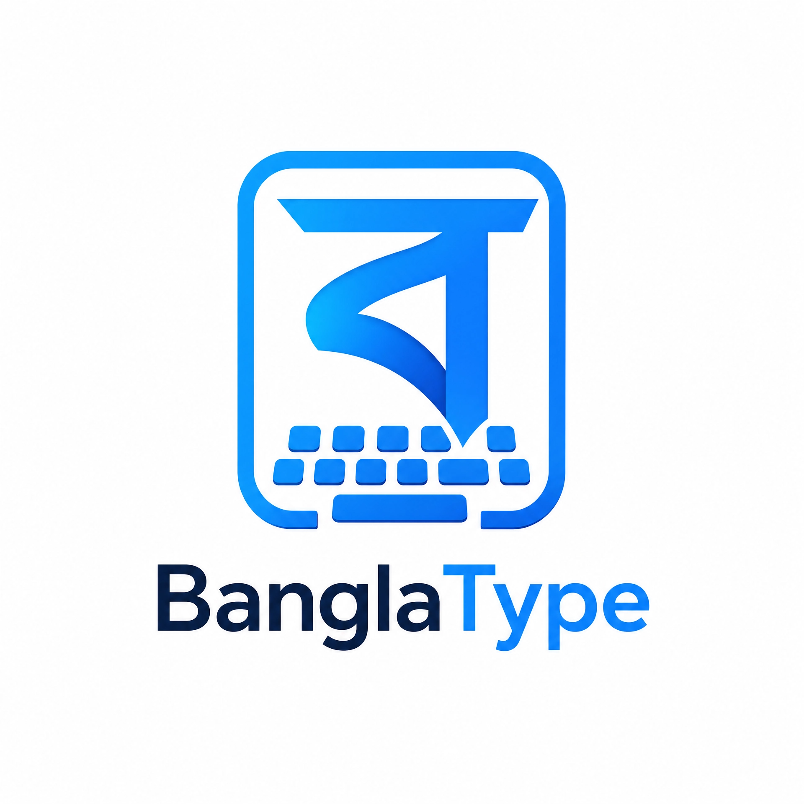

# BanglaType Keyboard — হোক লেখা প্রাণবন্ত ✨

<div align="center">
  
  <p><strong>Advanced • Secure • Material 3</strong></p>
</div>

<p align="center">
  
  
  
  
</p>

**BanglaType Keyboard** is an advanced, free, and lightweight input method editor (IME) for Android. It is designed to provide a premium typing experience with **Smart Phonetic**, **Fixed Layouts**, and **Speech-to-Text** capabilities, all while keeping your data 100% offline and secure.

---

## 🚀 Key Features

### ⌨️ Intelligent Typing
- **Multiple Layouts** — Avro (Phonetic), Jatiyo, and Probhat, plus English QWERTY.
- **Smart Prediction** — Context-aware word suggestions as you type.
- **Text Shortcuts** — Create triggers (e.g., `omw`) that expand into full phrases (e.g., `On my way!`).
- **Bangla Numerals** — Automatic conversion to Bangla digits during Bengali input.

### 🎙️ Advanced Input
- **In-App Voice Typing** — High-accuracy speech-to-text directly in the keyboard.
- **Clipboard Manager** — Store, manage, and pin frequently used clips for quick access.
- **Smart Calculator** — Perform calculations directly in the text field (e.g., `5+5` becomes `10`).

### 🎨 Material 3 UI & Customization
- **Modern UI Overhaul** — Clean, card-based interface with Material 3 principles.
- **Premium Themes** — Choose from built-in presets (Midnight, Ocean, Sunset) or create your own with a custom photo.
- **One-Handed Mode** — Align the keyboard for effortless typing on large screens.
- **Flexible Layouts** — Adjustable height, key borders, number row, and custom fonts.

### 🔒 Privacy First
- **100% Offline** — No internet permission required. Your keystrokes never leave your device.
- **Safe Storage** — Uses device-protected storage to remain functional during Direct Boot.
- **Open Source** — Transparency you can trust.

---

## 🎨 Brand Identity

BanglaType follows a professional and vibrant design language:
- **Brand Blue (#0078F8):** Our primary color for a modern, energetic feel.
- **Navy Text (#002040):** For sharp, professional readability.
- **Off-White Background (#F8F8F8):** A clean canvas that makes content pop.

---

## 🏗️ Building from Source

**Requirements:**
- Android Studio Ladybug (or newer)
- JDK 17
- Android SDK (Min API 26, Target API 35)

**Steps:**
```bash
# Clone the repository
git clone https://github.com/mohammad-sheikh-shahinur-rahman/BanglaType-Android.git
cd BanglaType-Android

# Build Debug APK
./gradlew assembleDebug
```

---

## 🤝 Contributions

Contributions are what make the open-source community such an amazing place to learn, inspire, and create. Any contributions you make are **greatly appreciated**.

1. Fork the Project
2. Create your Feature Branch (`git checkout -b feature/AmazingFeature`)
3. Commit your Changes (`git commit -m 'Add some AmazingFeature'`)
4. Push to the Branch (`git push origin feature/AmazingFeature`)
5. Open a Pull Request

---

## 📄 License

Distributed under the **GNU General Public License v3.0**. See `LICENSE` for more information.

---

## 👨‍💻 Developer & Contact

**Mohammad Sheikh Shahinur Rahman**  
*Software Engineer, Author, and Cyber Security Expert*

- **Website:** [amadersomaj.com](https://amadersomaj.com)
- **LinkedIn:** [In/Mohammad-Sheikh-Shahinur-Rahman](https://www.linkedin.com/in/mohammad-sheikh-shahinur-rahman/)
- **Facebook:** [BanglaTypeKeyboard](https://www.facebook.com/BanglaTypeKeyboard)
- **Email:** info@amadersomaj.com

<div align="center">
  <sub>Built with ❤️ by IT Amadersomaj Inc.</sub>
</div>
